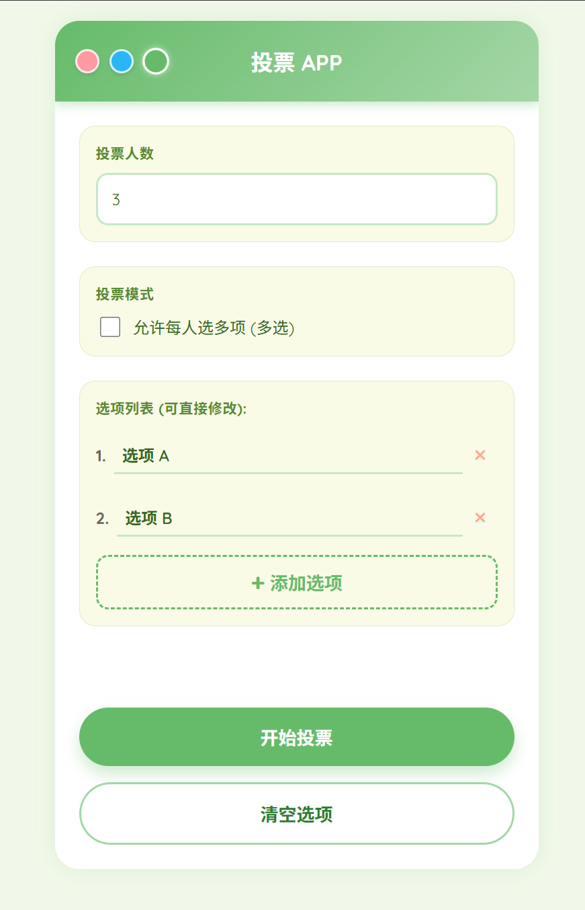

# webapp_vote

一个简单有趣的小型网页投票程序，帮助你和小伙伴出行聚会时快速决定去哪里、玩什么，解决“选择困难症”！

## 演示网站

[点击此处访问项目演示网站](https://xunuoxie.github.io/webapp_vote/)

## 功能简介

- 支持自定义投票选项
- 可选择单选/多选
- 支持为用户随机分配投票
- 页面简洁，操作方便
- 支持移动端/桌面浏览器

## 使用方法

1. 克隆仓库到本地  
   ```bash
   git clone https://github.com/XUNUO-66/webapp_vote.git
   ```

2. 进入项目目录，打开 `index.html` 即可在本地浏览器访问，无需额外环境依赖。

3. 或者直接部署到自己的服务器/静态空间即可使用。

## 示例截图



## 参与贡献

欢迎 issue、提交 PR 一起完善项目。